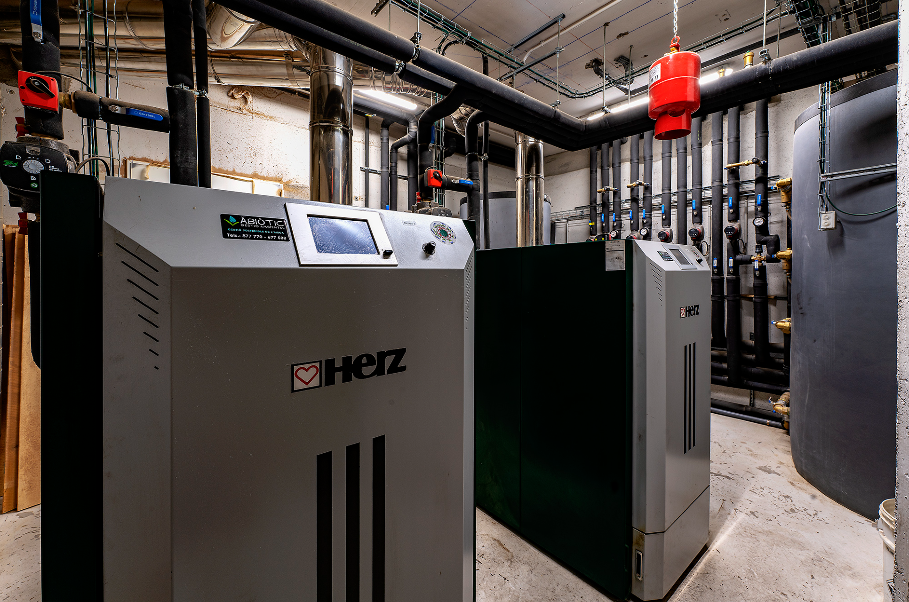
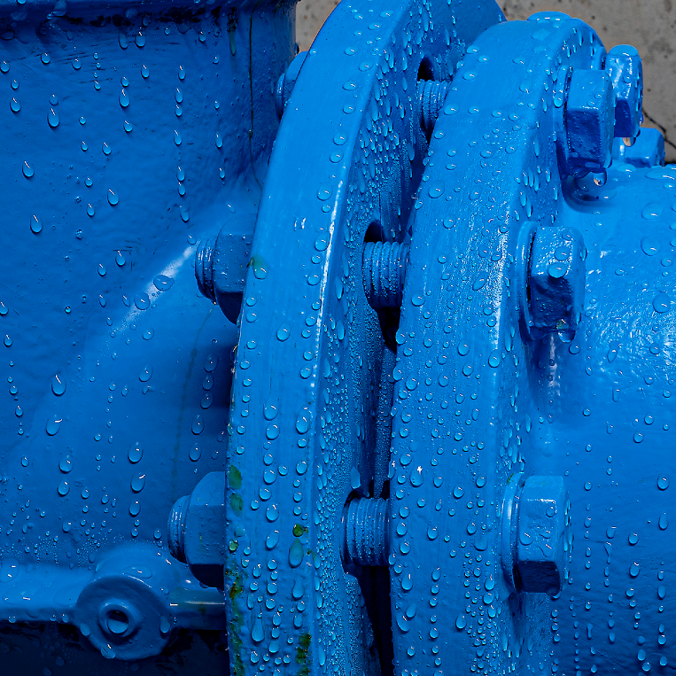

# Enginyeria i Tecnologia

Àbiòtic integra tecnologia i innovació en projectes d'infraestructures i gestió ambiental per obtenir solucions tècniques eficients i sostenibles.

---

## Serveis

- Disseny i execució de projectes tècnics.
- Incorporació de noves tecnologies i digitalització.
- Suport tècnic en enginyeria ambiental i hidràulica.

---

## Aplicacions

- Projectes d'innovació tecnològica
- Infraestructures sostenibles

---

## Imatges

*Hero i imatge principal de la pàgina. Instal·lació de calderes de biomassa.*

*Imatge lateral de la pàgina. Detall de vàlvula d'instal·lació hídrica.*
